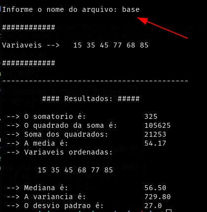

# Exercicio Estatistica

Fiz este exercicios para praticar a linguagem C juntamente com os conhecimento aprendendios em sala de aula da materia de Estatistica basica.

## Funcionamento
* O codigo necessita que um arquivo que contenha as variaveis, esteja no mesmo **diretorio**.
* O nome deve ser digitado corretamente, respeitando as letras maiusculas e minusculas, nao esquecendo da extensão.
* As variaveis precisam estar separadas por espaço simples.

## Como usar?

* Basta compilar com o gcc, caso encontre alguma problema com a biblioteca math, usar o parametro `-lm`.
Comandos:

```
$ gcc recebeVariaveis.c -o output
```

## Exemplo


